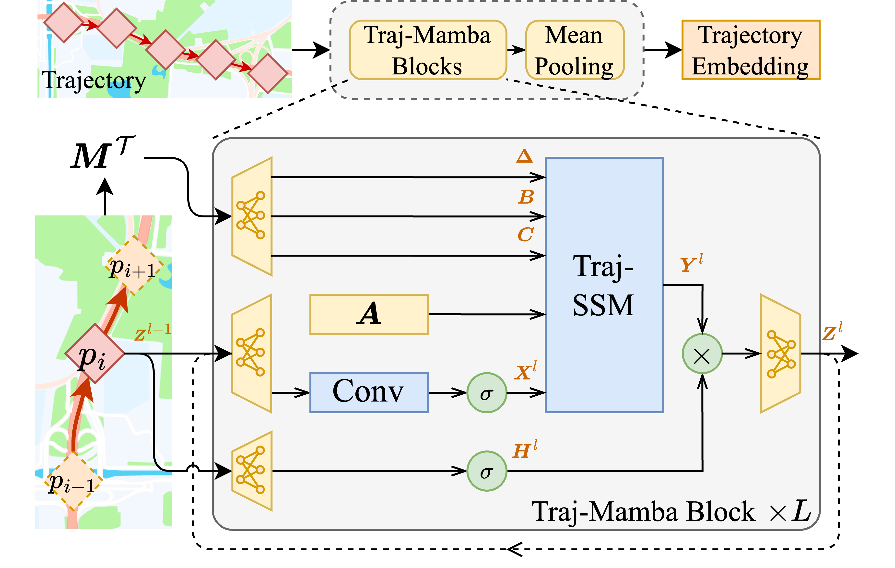

# PTrajM: Efficient and Semantic-rich Trajectory Learning with Pretrained Trajectory-Mamba

Implementation code of the *Pretrained Trajectory-Mamba* (**PTrajM**) model.

## Hands-on

Set OS env parameters:

```bash
export SETTINGS_CACHE_DIR=/dir/to/cache/setting/files;
export MODEL_CACHE_DIR=/dir/to/cache/model/parameters;
export PRED_SAVE_DIR=/dir/to/save/predictions;
```

Run the main script:

```bash
python main.py -s local_test;
```

## Model Structure



The learnable model of PTrajM, Trajectory-Mamba. It incorporates movement behavior parameterization and a trajectory state-space model (Traj-SSM) to extract continuous movement behavior.


The travel purpose-aware pre-training procedure of PTrajM. It aligns the learned embeddings of Trajectory-Mamba with the travel purpose identified by the road and POI encoders.

## Technical Structure

The parameters and experimental settings are controlled by a JSON configuration file. `settings/local_test.json` provides an example.

The `sample` directory contains subsets of the Chengdu and Xian datasets for reference and quick debugging. The full datasets have the same file format and fields.